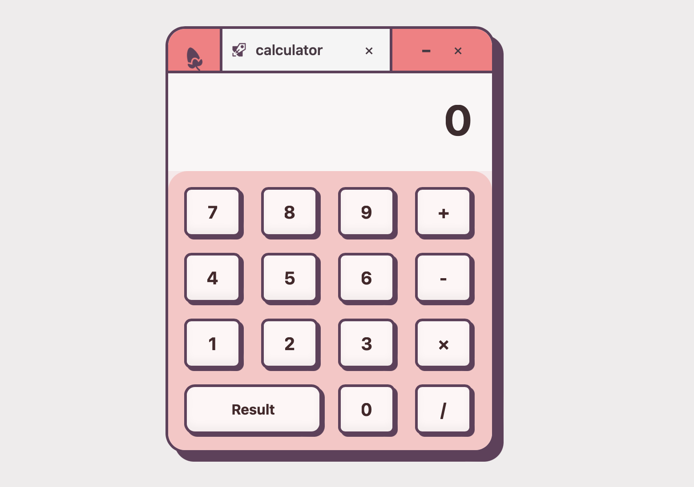

# 🧮 Calculator App

A clean and interactive calculator application built with a retro-inspired UI.  
This project supports basic arithmetic operations with smooth animations and keyboard support.
<p align="center">
  
</p>

## ✨ Features

### 🎨 Design
- **Retro-Inspired UI**: Custom window interface with pink and cream color scheme
- **Smooth Animations**: Hover effects and button press feedback
- **Responsive Layout**: Adapts to different screen sizes (mobile-friendly)
- **Custom Header**: Window controls (minimize/close buttons) and branding

### 🔢 Functionality
- **Basic Arithmetic Operations**: Addition (+), Subtraction (-), Multiplication (×), Division (/)
- **Real-time Display**: Shows current input and full expression
- **Continuous Calculations**: Chain multiple operations together
- **Error Handling**: Prevents division by zero and invalid operations
- **Smart Input Reset**: Automatically clears after getting a result

### ⌨️ Keyboard Support
- **Number Keys** (0-9): Input numbers
- **Operator Keys** (+, -, *, /): Perform operations
- **Enter/=**: Calculate result
- **Escape/C**: Clear calculator

### 📱 Dual Implementation
- **Web Version**: Interactive browser-based calculator (HTML/CSS/JS)
- **Python Version**: Command-line calculator with additional power operator (**)

## 🚀 Getting Started

### Prerequisites
- Modern web browser (Chrome, Firefox, Safari, Edge)
- Python 3.x (for Python version)

### Installation

1. **Clone the repository**
   ```bash
   git clone https://github.com/varshitha204/Calculator_master.git
   cd Calculator-master
   ```

2. **Run Web Version**
   - Simply open `index.html` in your web browser
   - Or use a local server:
     ```bash
     # Python 3
     python -m http.server 8000
     
     # Then open http://localhost:8000
     ```

3. **Run Python Version**
   ```bash
   python calculator.py
   ```

## 📂 Project Structure

```
Calculator_master/
├── index.html              # Main HTML structure
├── style.css              # Styling and animations
├── script.js              # Calculator logic and event handlers
├── calculator.py          # Python CLI version
├── README.md              # Documentation
└── images/
    ├── icon.png           # Logo icon
    └── rocket.png         # Calculator header icon
```

## 🎯 How to Use

### Web Calculator

1. **Click Numbers**: Click on number buttons (0-9) to input values
2. **Select Operator**: Click +, -, ×, or / to choose operation
3. **Get Result**: Click "Result" button or press Enter to calculate
4. **Continue Calculation**: After a result, click an operator to continue with that result
5. **Start Fresh**: After a result, click a number to start a new calculation
6. **Clear**: Press Escape or C to clear everything

### Python Calculator

1. Enter the first number
2. Enter an operator (+, -, *, /, **)
3. Enter the second number
4. View the result
5. Choose to continue or exit

## 💻 Code Highlights

### Smart Input Reset
```javascript
let shouldResetOnNextInput = false;

// After calculation, flag is set to clear on next number input
resultButton.addEventListener('click', () => {
    calculate();
    operation = null;
    shouldResetOnNextInput = true;
});
```

### Continuous Calculations
```javascript
operatorButtons.forEach(button => {
    button.addEventListener('click', () => {
        // Calculate previous operation before starting new one
        if (previousInput !== '') {
            calculate();
        }
        // Store operation and continue
        operation = op;
        previousInput = currentInput;
        currentInput = '';
    });
});
```

### Division by Zero Protection
```javascript
case '/':
    if (current === 0) {
        alert('Cannot divide by zero!');
        clear();
        return;
    }
    result = prev / current;
    break;
```

## 🎨 Styling Details

- **Color Palette**:
  - Primary Pink: `#FF7980`
  - Background: `#f7e9ea`
  - Button Background: `#fff6f6`
  - Border/Shadow: `#62405B`
  - Button Plate: `#FBC5C5`

- **Typography**: System fonts (Apple System, Segoe UI, Roboto)
- **Shadows**: Custom box shadows for depth and 3D effect
- **Animations**: Smooth transitions on hover and click

## 📱 Responsive Design

```css
@media (max-width: 420px) {
    .calculator { max-width: 320px; }
    .btn { width: 56px; height: 52px; font-size: 18px; }
    .result { font-size: 40px; }
}
```

## 🛠️ Technologies Used

- **HTML5**: Semantic structure
- **CSS3**: Flexbox, Grid, Custom styling, Animations
- **Vanilla JavaScript**: DOM manipulation, Event handling, Calculator logic
- **Python**: CLI alternative implementation

## 🔮 Future Enhancements

- [ ] Add decimal point support
- [ ] Implement backspace/delete functionality
- [ ] Add memory functions (M+, M-, MR, MC)
- [ ] Include scientific calculator mode
- [ ] Add calculation history
- [ ] Implement themes (light/dark mode)
- [ ] Add parentheses support for complex expressions
- [ ] Store calculation history in localStorage

## 🐛 Known Issues

- Division operator shows `/` but internally uses `×` for multiplication display
- No decimal point functionality currently implemented
- Expression display shows partial expressions during chained calculations

## 📝 Learning Outcomes

This project helped practice:
- Event-driven programming in JavaScript
- State management in vanilla JS
- CSS Grid and Flexbox layouts
- Responsive design principles
- Error handling and edge cases
- Keyboard event handling
- Creating custom UI components

## 👨‍💻 Author

**Kesani saivarshitha**
- GitHub: (https://github.com/varshitha204)

## 📄 License

This project is open-source and created for learning and practice purposes.
---
